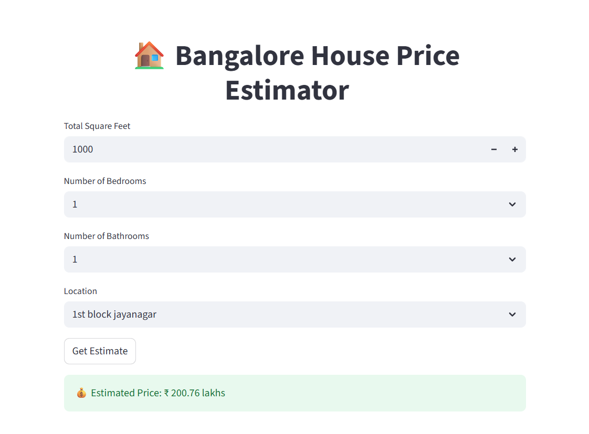

# 🏠 House Price Estimator

A machine learning application that predicts house prices based on location and other property features.

---

## 📌 Table of Contents
- [Features](#features)
- [Demo / Screenshots](#demo--screenshots)
- [Usage](#usage)
- [Project Structure](#project-structure)
- [Technologies Used](#technologies-used)
- [Model Details](#model-details)

---

## ✨ Features
- Predicts house prices using a trained machine learning model
- User-friendly interface built with Streamlit / FastAPI backend
- Handles data preprocessing and prediction seamlessly
- Ready to deploy locally or to the cloud

---

## 📷 Demo / Screenshots
  

---

## 🖥️ Usage
- Open the Streamlit app in your browser (usually opens automatically)
- Fill in property details (location, area, etc.)
- Click Predict Price to see the estimated price

---

## 📁 Project Structure
HOUSE-PRICE-ESTIMATOR/
│
├── frontend/                       # Streamlit frontend
│   ├── app.py
│   └── house_price_estimator/
│
├── model/                          # Trained model files
│   ├── Bengaluru_House_Data.csv
│   ├── column.json
│   ├── house_prices_model.pkl
│   └── hpp.ipynb
│
├── server/                         # FastAPI backend 
│   ├── __pycache__/
│   ├── artifacts/
│   ├── main.py
│   └── util.py
│
├── venv/
│
├── .gitignore
├── pyproject.toml                  # Python dependencies
├── requirements.txt
└── README.md

---

## 🛠️ Technologies Used

- Python 3.13+
- scikit-learn
- pandas & numpy
- Streamlit
- FastAPI 
- pickle / joblib (for saving models)

---

## 🧠 Model Details

- **Model Types:** Linear Regression  
- **Target Variable:** House price 
- **Input Features:**  
  - Location  
  - Area (sqft)  
  - Number of bedrooms  
  - Number of bathrooms  
- **Dataset:** data collected from Kaggle 
- **Preprocessing Steps:**
  - Handling missing values
  - Converting categorical variables (e.g., location, area_type) to numerical (using one-hot encoding)
  - Feature scaling 
- **Training Method:** Trained with scikit-learn using an 80/20 train-test split
- **Evaluation Metrics:**  
  - R² Score: `0.87`
- **Model File:** Saved as `model/house_price_model.pkl` using `pickle`

---

